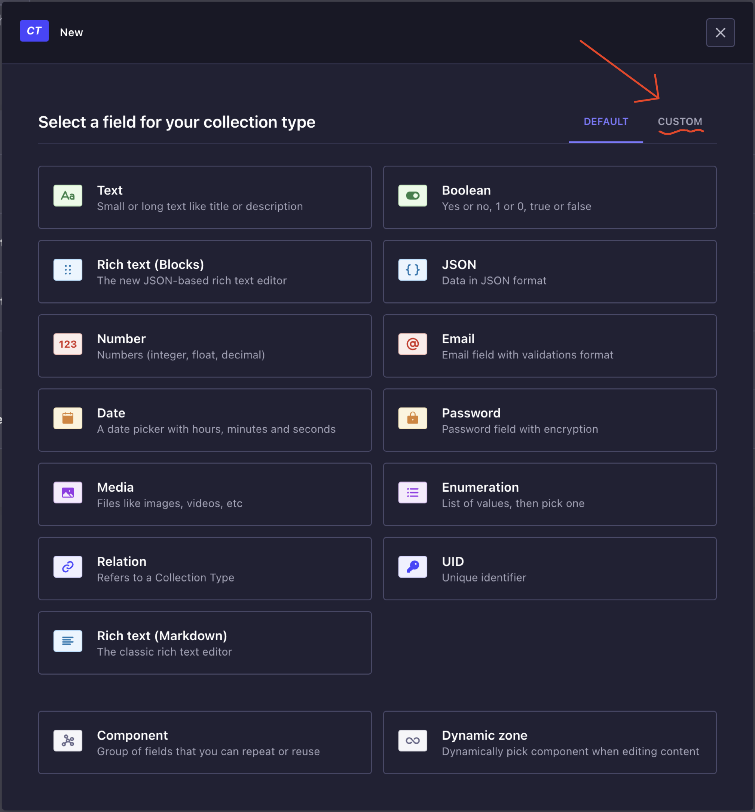
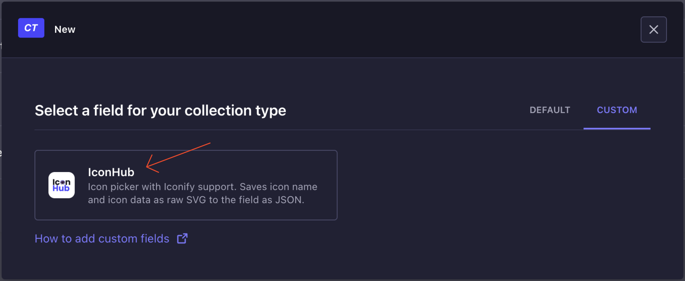
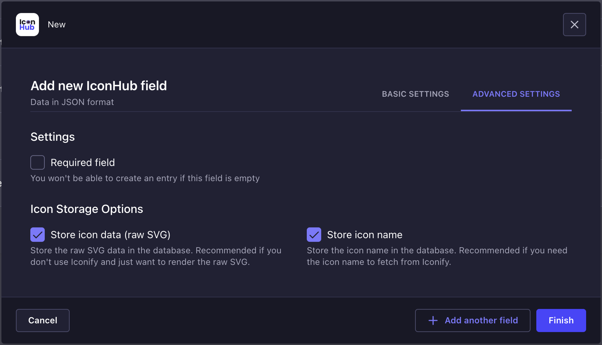
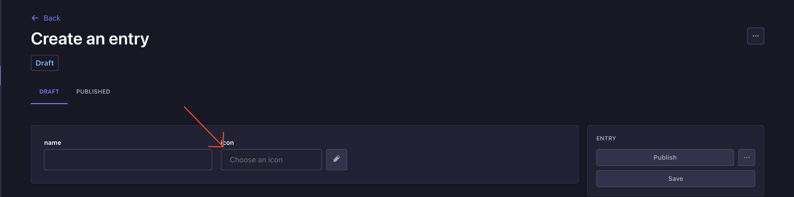
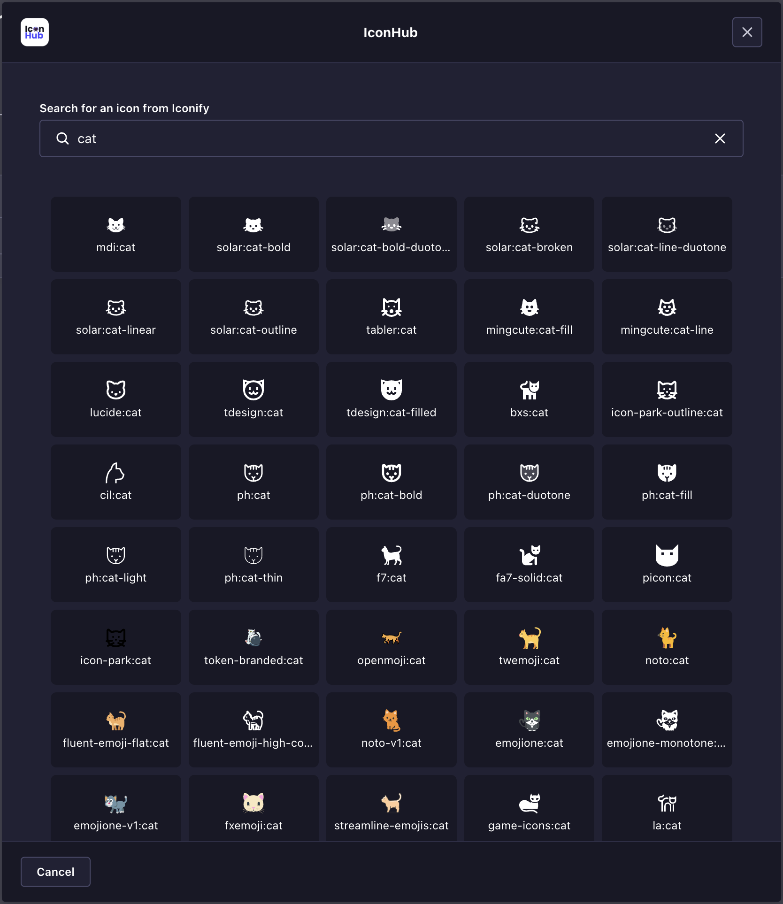
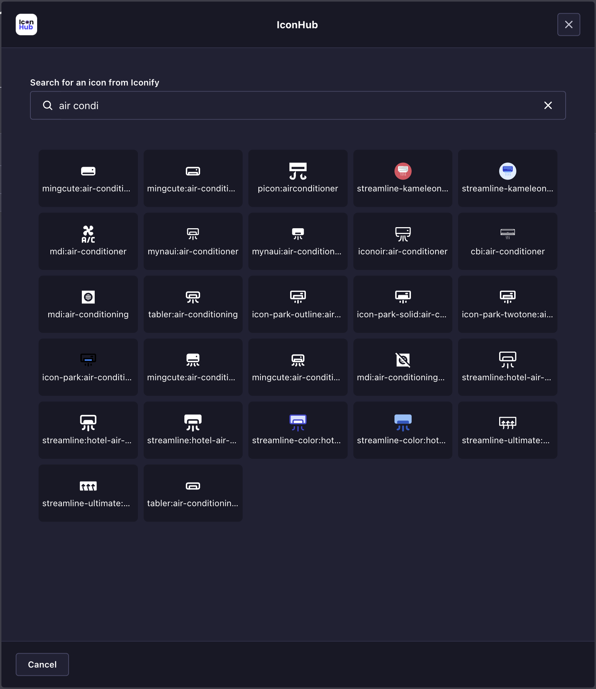
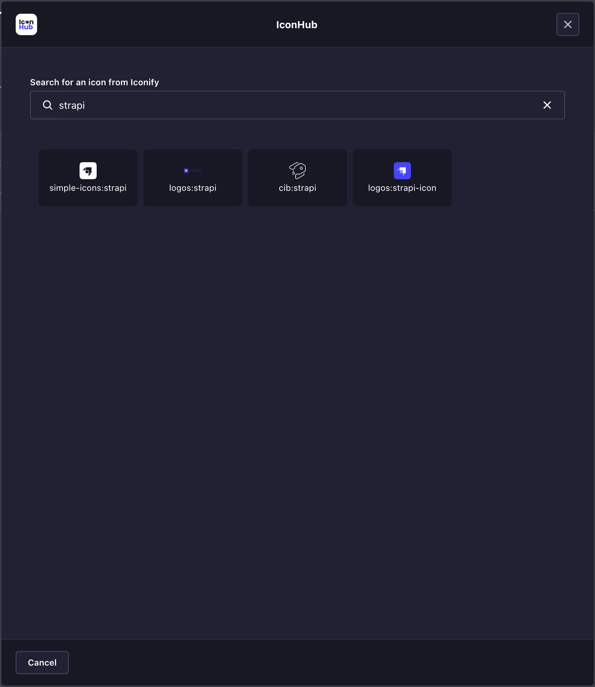
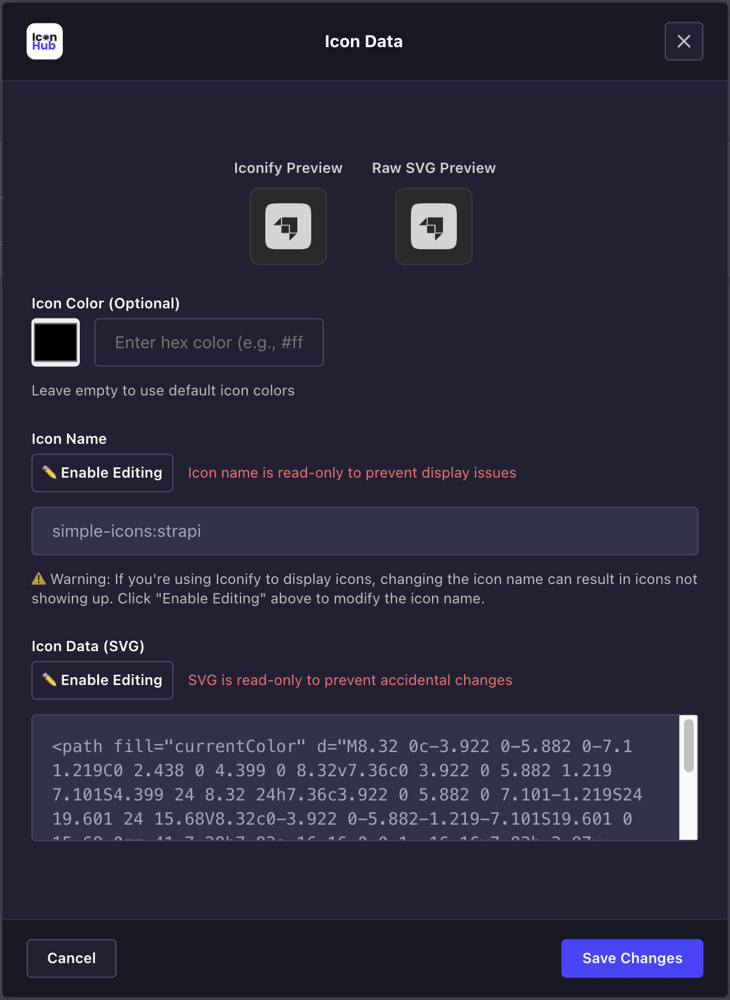
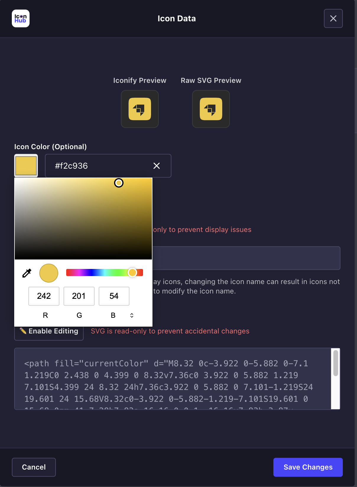
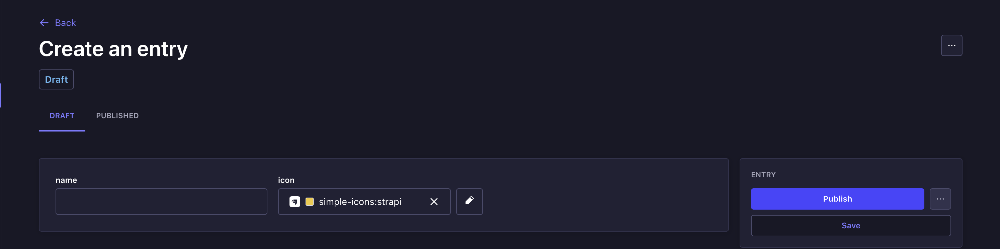

# Strapi IconHub


**The most lightweight and customizable icon picker for Strapi CMS** 🚀

Access **200,000+ professional icons** instantly through Iconify's massive library, with zero bloat. Features a **built-in color picker** and advanced editing tools.

[](https://strapi.io)
[](https://www.typescriptlang.org)
[](LICENSE)

## Table of Contents

- [Features](#features)
- [Quick Start](#quick-start)
- [Configuration](#configuration)
- [Usage Examples](#usage-examples)
- [Frontend Implementation](#frontend-implementation)
- [API Reference](#api-reference)

## Features

- 🔍 **200K+ Icons**: Access via Iconify integration
- 🎨 **Visual Picker**: Intuitive icon selection in Strapi admin
- 🧩 **Flexible Storage**: Choose between icon name, raw SVG, or both
- 🎨 **Color Customization**: Built-in color picker and editing tools
- 🧱 **Universal**: Works with all Strapi content types
- ⚡ **Performance**: Lightweight and optimized

## Quick Start

### 1. Install

```bash
npm i @arshiash80/strapi-plugin-iconhub
# or
yarn add @arshiash80/strapi-plugin-iconhub
```

### 2. Rebuild Admin

```bash
npm run build && npm run develop
# or
yarn build && yarn develop
```

### 3. Verify Installation

Navigate to **Settings > Plugins** to confirm IconHub is installed.


### 4. Add to Content Type

1. Open **Content-Type Builder** and navigate to or create a new collection.

2. Add custom field → Select **IconHub**
   



3. Configure storage preferences

## ⚙️ Configuration



IconHub offers flexible storage options to optimize for your use case:

| Option              | Description                              | Use Case                                    |
| ------------------- | ---------------------------------------- | ------------------------------------------- |
| **Store Icon Name** | Saves icon identifier (e.g., "mdi:home") | Iconify integration, smaller database       |
| **Store Icon Data** | Saves raw SVG code                       | Offline rendering, no external dependencies |
| **Both** (default)  | Saves both options                       | Maximum flexibility, fallback support       |

**Note**: At least one option must be selected.

## Usage Examples

### Basic Icon Selection

The icon picker appears in your content entries with search functionality:






### Icon Editing & Customization

- **Color Picker**: Visual color selector with hex input
- **Live Preview**: See changes in real-time
- **Advanced Editing**: Modify icon names and SVG data (with safety controls)






### Data Structure

```typescript
type IconField = {
  iconName?: string; // Icon identifier (if enabled)
  iconData?: string; // Raw SVG (if enabled)
  width?: number; // Icon dimensions
  height?: number;
  color?: string; // Custom color (hex format)
};
```

## 💻 Frontend Implementation

### Next.js Example

```typescript
import { Icon } from "@iconify/react";

type Tag = {
  name: string;
  icon: {
    iconName?: string;
    iconData?: string;
    width?: number;
    height?: number;
    color?: string;
  };
};

export default function IconDisplay({ tags }: { tags: Tag[] }) {
  return (
    <div className="flex flex-wrap gap-2">
      {tags.map((tag, i) => (
        <div key={i} className="bg-gray-800 px-3 py-2 rounded flex items-center gap-2">
          {/* Iconify Mode */}
          {tag.icon.iconName && (
            <Icon
              icon={tag.icon.iconName}
              width={tag.icon.width || 16}
              height={tag.icon.height || 16}
              color={tag.icon.color}
            />
          )}

          {/* Raw SVG Mode */}
          {tag.icon.iconData && (
            <svg
              width={tag.icon.width || 16}
              height={tag.icon.height || 16}
              viewBox={`0 0 ${tag.icon.width || 16} ${tag.icon.height || 16}`}
              dangerouslySetInnerHTML={{ __html: tag.icon.iconData }}
              style={{ color: tag.icon.color }}
            />
          )}

          <span>{tag.name}</span>
        </div>
      ))}
    </div>
  );
}
```

### Styling Options

```typescript
// Custom colors
<Icon icon="mdi:home" color="#ff0000" />

// CSS classes
<Icon icon="mdi:home" className="text-5xl text-blue-500" />

// Inline styles
<Icon icon="mdi:home" style={{ filter: 'drop-shadow(0 4px 8px rgba(0,0,0,0.3))' }} />
```

## API Reference

### Configuration Options

- `storeIconName` (boolean): Enable icon name storage
- `storeIconData` (boolean): Enable raw SVG storage
- `required` (boolean): Make field mandatory

### Field Properties

- `iconName`: Iconify identifier string
- `iconData`: Raw SVG markup
- `width/height`: Icon dimensions
- `color`: Custom hex color value

### Validation Rules

- At least one storage option must be selected
- Color values must be valid hex format
- Icon dimensions are automatically detected

## Use Cases

Just be creative!

## Compatibility

- **Strapi**: v4 & v5
- **TypeScript**: Full support
- **Frontend**: If you can render svg in your frontend, its compatible. (Next.js, Vue, React, and more)
- **Icons**: 200K+ Iconify icons + custom SVGs

## License

MIT License - see [LICENSE](LICENSE) for details.
